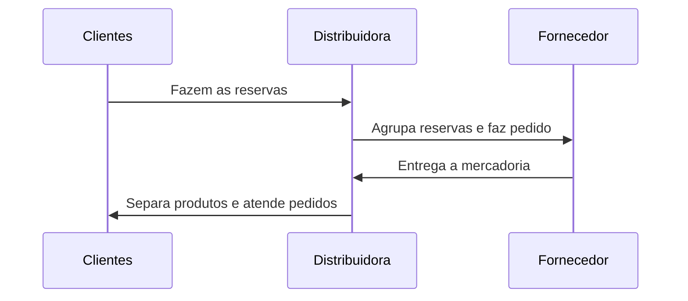

# DPL Orders

## VSCode setup

Add the following to settings.json

```
{
    "pylint.args": [
        "--load-plugins=pylint_django",
        "--django-settings-module=dpl_orders.settings",
    ],
}
```



**Reserva (*Preorder*)**: a distribuidora não tem a mercadoria para pronta entrega. Fará o pedido para o fornecedor e repassará para os clientes.

**Pedido (*Order*)**: a distribuidora tem a mercadoria para pronta entrega. Atenderá o pedido imediatamente. O pedido pode ser resultado de uma reserva ou não.