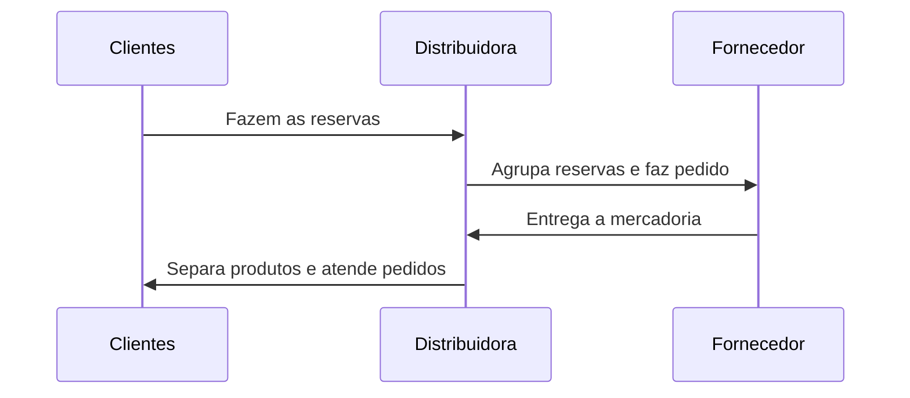
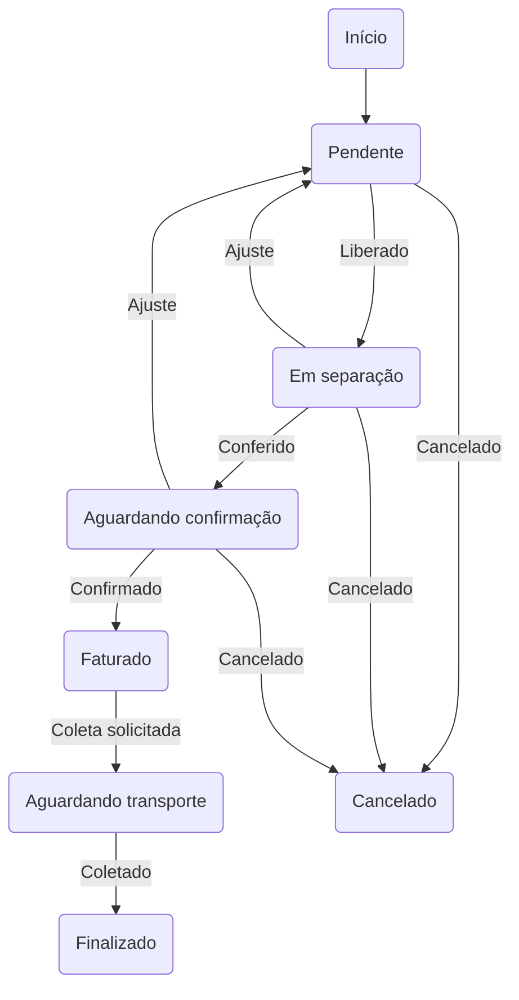

# DPL Orders

## VSCode setup

Add the following to settings.json

```
{
    "pylint.args": [
        "--load-plugins=pylint_django",
        "--django-settings-module=dpl_orders.settings",
    ],
}
```

## To update the translations

### To create/update the translations files
```
manage.py makemessages -l pt_BR
```

### To compile the translations
```
manage.py compilemessages
```

## Testing

### Updating coverage

```
coverage run manage.py test # Optional: -v 2
coverage html
firefox htmlcov/index.html
```

## Restore datase in Linux

Reference:
* [Run SQL Server Linux container images with Docker](https://learn.microsoft.com/en-us/sql/linux/quickstart-install-connect-docker?view=sql-server-ver16&tabs=cli&pivots=cs1-bash)
* [Restore a SQL Server database in a Linux container](https://learn.microsoft.com/en-us/sql/linux/tutorial-restore-backup-in-sql-server-container?view=sql-server-ver16&tabs=cli)

### Pull the docker image
```
sudo docker pull mcr.microsoft.com/mssql/server:2022-latest
```

### Run the container
```
sudo docker run -e "ACCEPT_EULA=Y" -e "MSSQL_SA_PASSWORD=***password***" \
   -p 1433:1433 --name sql1 --hostname sql1 \
   -d \
   mcr.microsoft.com/mssql/server:2022-latest

```

### Create a directory in the container to store the backup file
```
sudo docker exec -it sql1 mkdir /var/opt/mssql/backup
```

### Copy the backup file to the container
```
sudo docker cp vldados.bak sql1:/var/opt/mssql/backup
```

### Unpack the backup file
```
sudo docker exec -it sql1 /opt/mssql-tools/bin/sqlcmd -S localhost \
   -U SA -P '***password***' \
   -Q 'RESTORE FILELISTONLY FROM DISK = "/var/opt/mssql/backup/vldados.bak"' \
   | tr -s ' ' | cut -d ' ' -f 1-2
```

### Restore the database to a SQL Server container
```
sudo docker exec -it sql1 /opt/mssql-tools/bin/sqlcmd \
   -S localhost -U SA -P '***password***' \
   -Q 'RESTORE DATABASE vldados FROM DISK = "/var/opt/mssql/backup/vldados.bak" WITH MOVE "vldados_Data" TO "/var/opt/mssql/data/vldados_1.mdf", MOVE "vldados_Data2" TO "/var/opt/mssql/data/vldados_2.mdf", MOVE "vldados_Data3" TO "/var/opt/mssql/data/vldados_3.mdf", MOVE "vldados_Data4" TO "/var/opt/mssql/data/vldados_4.mdf", MOVE "vldados_Data5" TO "/var/opt/mssql/data/vldados_5.mdf", MOVE "vldados_Data6" TO "/var/opt/mssql/data/vldados_6.mdf", MOVE "vldados_Data7" TO "/var/opt/mssql/data/vldados_7.mdf", MOVE "vldados_Data8" TO "/var/opt/mssql/data/vldados_8.mdf", MOVE "vldados_Data9" TO "/var/opt/mssql/data/vldados_9.mdf", MOVE "vldados_Data10" TO "/var/opt/mssql/data/vldados_10.mdf", MOVE "vldados_Log" TO "/var/opt/mssql/data/vldados_1.ldf", MOVE "vldados_Log2" TO "/var/opt/mssql/data/vldados_2.ldf", MOVE "vldados_Log3" TO "/var/opt/mssql/data/vldados_3.ldf", MOVE "vldados_Log4" TO "/var/opt/mssql/data/vldados_4.ldf", MOVE "vldados_Log5" TO "/var/opt/mssql/data/vldados_5.ldf", MOVE "vldados_Log6" TO "/var/opt/mssql/data/vldados_6.ldf", MOVE "vldados_Log7" TO "/var/opt/mssql/data/vldados_7.ldf", MOVE "vldados_Log8" TO "/var/opt/mssql/data/vldados_8.ldf", MOVE "vldados_Log9" TO "/var/opt/mssql/data/vldados_9.ldf", MOVE "vldados_Log10" TO "/var/opt/mssql/data/vldados_10.ldf"'
```

### Restore the database to a local SQL Server

```
USE [master]
RESTORE DATABASE [vldados] FROM DISK = N'/mnt/sdb1/vldados/vldados.bak'
WITH MOVE 'vldados_Data' TO '/mnt/sdb1/vldados/vldados_1.mdf', 
MOVE 'vldados_Data2' TO '/mnt/sdb1/vldados/vldados_2.mdf', 
MOVE 'vldados_Data3' TO '/mnt/sdb1/vldados/vldados_3.mdf', 
MOVE 'vldados_Data4' TO '/mnt/sdb1/vldados/vldados_4.mdf', 
MOVE 'vldados_Data5' TO '/mnt/sdb1/vldados/vldados_5.mdf', 
MOVE 'vldados_Data6' TO '/mnt/sdb1/vldados/vldados_6.mdf', 
MOVE 'vldados_Data7' TO '/mnt/sdb1/vldados/vldados_7.mdf', 
MOVE 'vldados_Data8' TO '/mnt/sdb1/vldados/vldados_8.mdf', 
MOVE 'vldados_Data9' TO '/mnt/sdb1/vldados/vldados_9.mdf', 
MOVE 'vldados_Data10' TO '/mnt/sdb1/vldados/vldados_10.mdf', 
MOVE 'vldados_Log' TO '/mnt/sdb1/vldados/vldados_1.ldf',
MOVE 'vldados_Log2' TO '/mnt/sdb1/vldados/vldados_2.ldf',
MOVE 'vldados_Log3' TO '/mnt/sdb1/vldados/vldados_3.ldf',
MOVE 'vldados_Log4' TO '/mnt/sdb1/vldados/vldados_4.ldf',
MOVE 'vldados_Log5' TO '/mnt/sdb1/vldados/vldados_5.ldf',
MOVE 'vldados_Log6' TO '/mnt/sdb1/vldados/vldados_6.ldf',
MOVE 'vldados_Log7' TO '/mnt/sdb1/vldados/vldados_7.ldf',
MOVE 'vldados_Log8' TO '/mnt/sdb1/vldados/vldados_8.ldf',
MOVE 'vldados_Log9' TO '/mnt/sdb1/vldados/vldados_9.ldf',
MOVE 'vldados_Log10' TO '/mnt/sdb1/vldados/vldados_10.ldf'
```

## Naming conventions

**Reserva (*Preorder*)**: a distribuidora não tem a mercadoria para pronta entrega. Fará o pedido para o fornecedor e repassará para os clientes.

**Pedido (*Order*)**: a distribuidora tem a mercadoria para pronta entrega. Atenderá o pedido imediatamente. O pedido pode ser resultado de uma reserva ou não.

## Preorder and Order



## Order Sequence


